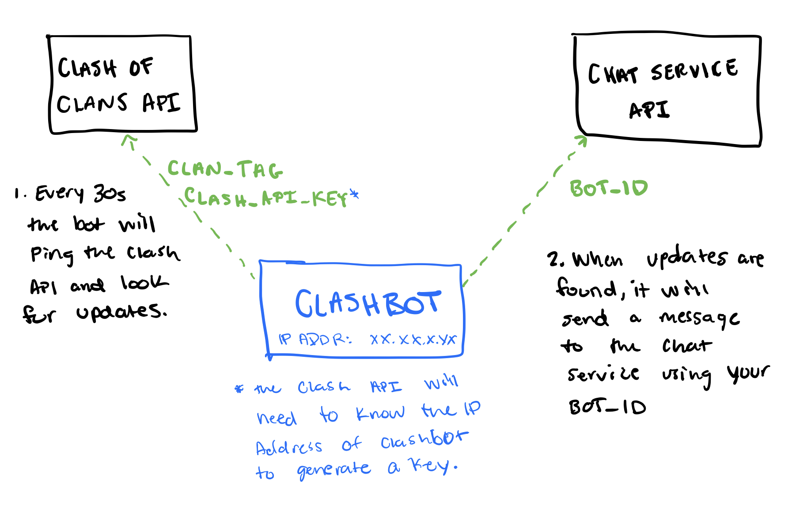

# ClashBot

[](https://travis-ci.org/johnverrone/ClashBot)

A chat bot that will send Clash of Clans information to your favorite chat client. Currently only developed for GroupMe but Slack and Discord are in the works.

**What does it do?**

Sends notifications for the following:

- War start
- Any war attack on an enemy base (tells you who attacked who and for how many stars)
- Close war (2 hours remaining)
- War ends (will share results and final star count)

## Getting Started

Want to use it?! Great, here's how to get this configured for your clan.

**warning:** The Clash of Clans API requires a static IP address for any incoming requests. If you plan to run this on a cloud service provider such as Heroku, GCP, or AWS there may be a cost associated with configuring a static IP.

### Architecture Overview



### Installing

Using go get:

```bash
go get github.com/johnverrone/clashbot

cd $GOPATH/src/github.com/johnverrone/clashbot

go build .
```

Using git clone:

```bash
git clone https://github.com/johnverrone/clashbot

cd clashbot

go build .
```

## Usage

### Environment Variables

- **CLAN_TAG**: This is your clan id (including the #) and can be found in the "My Clan" tab of your profile in the game.
- **CLASH_API_KEY**: This is the API Key to talk to the Clash of Clans API. You will need to create a developer account and key [here](https://developer.clashofclans.com/#/new-key).
- **GROUPME_BOT_ID**: Create a GroupMe bot [here](https://dev.groupme.com/bots) and set this variable to the generated Bot ID.

### Running the Bot

This will run the bot locally and should really only be used for development or if managing the server yourself.

```bash
export CLAN_TAG=[enter clan tag]
export CLASH_API_KEY=[enter api key]
export GROUPME_BOT_ID=[enter GroupMe Bot ID]
./clashbot
```

## Tests

Automated tests are included in their respective packages following the standard go `_test.go` file syntax. To run all tests:

```bash
go test ./...
```
